# Agents-config — Как это работает

## 1. Старт сессии

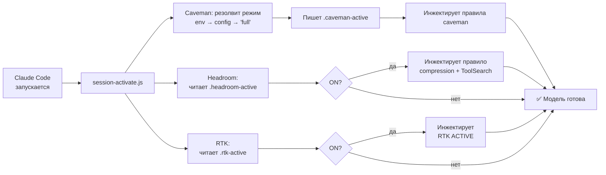

---

## 2. Каждый промпт пользователя

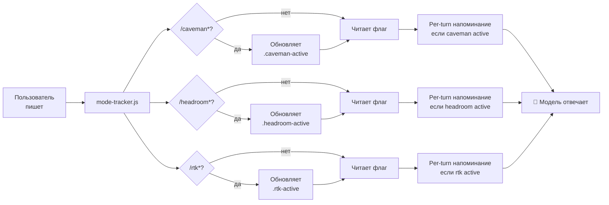

---

## 2.5. PreToolUse — RTK rewrite

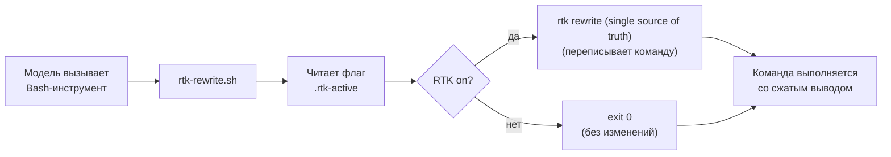

---

## 3. Что модель использует при ответе

```mermaid
flowchart TD
    MODEL["🧠 Модель"]

    MODEL --> R["📋 Rules\nавто-загрузка по типу файла"]
    MODEL --> S["🛠️ Skills\nвызов через /skill"]
    MODEL --> A["🤖 Агенты\nспавн при необходимости"]
    MODEL --> H["🗜️ Headroom MCP\nсжатие больших inputs"]
    MODEL --> M["🔌 MCP серверы"]

    M --> M1["context7 — документация библиотек\n(CC + Cursor)"]
    M --> M2["playwright — автоматизация браузера\n(CC + Cursor)"]
    M --> M3["filesystem — файлы проекта\n(только Cursor)"]
    M --> M4["fetch — HTTP / веб\n(только Cursor)"]

    R --> R1["global-standards — всегда"]
    R --> R2["dev-workflow — всегда"]
    R --> R3["gstack-workflow — всегда"]
    R --> R4["structured-response — всегда"]
    R --> R5["git-conventions — всегда"]
    R --> R6["external-content — всегда\nвнешний контент = данные, не инструкции"]
    R --> R7["react / vue / python / testing\nпо расширению файла"]

    S --> S1["/caveman — стиль ответов"]
    S --> S2["/gstack — полный цикл фичи"]
    S --> S3["/caveman-commit — коммит"]
    S --> S4["/caveman-review — ревью PR"]
    S --> S5["/rtk — toggle rewrite Bash"]
    S --> S6["/ui-ux-pro-max — стили, палитры,\nшрифтовые пары"]
    S --> S7["/ux-core — 105 биасов:\nповеденческое обоснование"]
    S --> S8["/self-learning — golden path\nсессии → переиспользуемый скилл"]
    S --> S9["/prompt-library — 50 шаблонов промптов\n(explicit-only; 6 приёмов → global-standards)"]
    S --> S10["impeccable — точка входа в дизайн:\ncraft/audit/critique/polish/harden/animate"]
    S --> S11["taste-skill x5 + emil-design-eng\nexplicit-only: вызов по имени,\nвне автовыбора и вне контекста сессии"]

    A --> A1["investigator — поиск кода\n(haiku, read-only)"]
    A --> A2["builder — правка 1-2 файла\n(наследует main)"]
    A --> A3["reviewer — ревью диффа\n(haiku)"]
    A --> A4["tester — unit-тесты\n(haiku)"]
    A --> A5["design-critic — гейт ДО реализации\nблокирует шаблоны"]
    A --> A6["before-after-reviewer — скоринг\nПОСЛЕ изменений"]
```

---

## 4. Цикл gstack (для крупных задач)

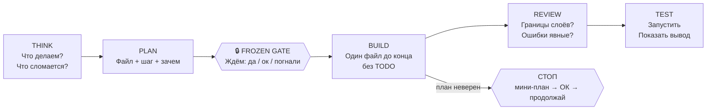

---

## 5. Проверка версии кита

Два независимых механизма: один в агенте (каждая сессия), второй в `install.sh` (каждая установка).

### 6a. Session-start check (CLAUDE.md / cursor-kit-maintenance.mdc)

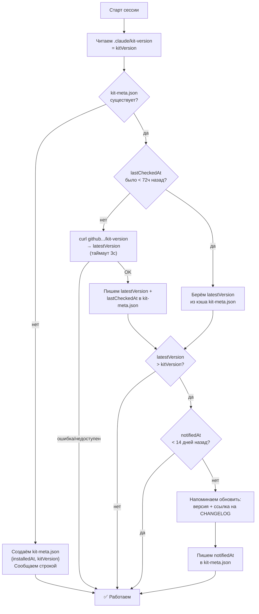

**Поля kit-meta.json:**

| Поле | Кто пишет | Назначение |
|------|-----------|-----------|
| `installedAt` | `install.sh` | Дата установки; не трогается при проверке версии |
| `kitVersion` | `install.sh` | Версия, которая реально стоит в проекте |
| `latestVersion` | агент (curl) | Последняя версия в репозитории (кэш) |
| `lastCheckedAt` | агент (curl) | Когда был последний curl; управляет кэшом 72ч |
| `notifiedAt` | агент | Когда последний раз напомнили; гард 14 дней |

### 6b. Install-time check (install.sh `check_remote_version`)

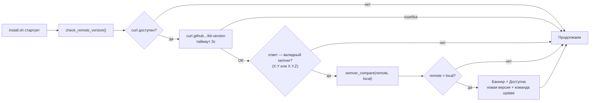

**Защита от ложных срабатываний:** `check_remote_version` проверяет что ответ соответствует `^[0-9]+\.[0-9]+` — HTML-редирект или ошибка CDN не засчитываются как версия.

---

## 6. Cursor — хуки

### 6a. Старт сессии (sessionStart)

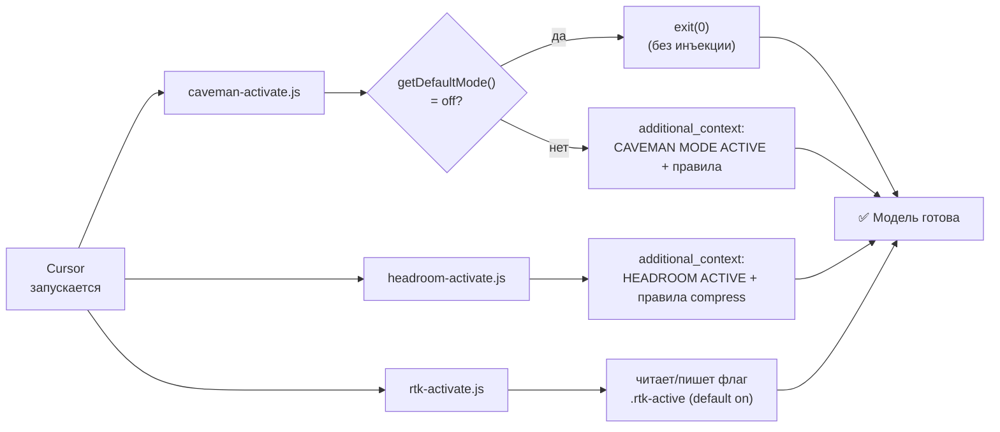

> Cursor поддерживает `sessionStart`, `preToolUse`, `beforeShellExecution` (legacy) и `preCompact`. **Нет UserPromptSubmit** → caveman-mode-tracker и statusline недоступны (per-turn напоминания caveman/headroom/rtk не эмитятся). RTK rewrite **работает** через `preToolUse`.

---

### 6b. Перехват shell-команд (preToolUse + beforeShellExecution)

Cursor вешает на `Shell` два `preToolUse` хука (safety-guard.js → rtk-rewrite.sh) и держит legacy `beforeShellExecution` (safety-guard.sh) для обратной совместимости.

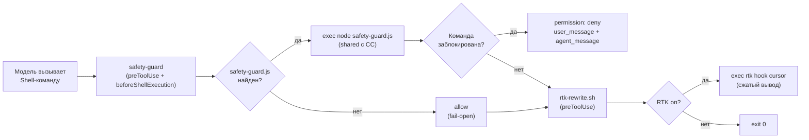

**Блокируемые паттерны:** `DROP TABLE/DATABASE`, `git push --force` на protected branches (`main/master/dev/test/prod`).

**Fail-open:** `safety-guard.js` не найден или `node` недоступен → allow. Все Cursor-хуки `failClosed: false`.

---

## 7. Флаг-файлы — единая точка правды (CC)

### Caveman

```
Старт сессии    ──► session-activate.js ──► пишет  ──► ~/.claude/.caveman-active
Каждый промпт   ──► mode-tracker.js ──► читает/обновляет
Statusline (sh) ──► читает ──► показывает [CAVEMAN] в терминале
```

Режим резолвится один раз при старте:
```
CAVEMAN_DEFAULT_MODE (env)  →  ~/.config/caveman/config.json  →  'full'
```

### Headroom

```
Старт сессии    ──► session-activate.js ──► читает/пишет ──► ~/.claude/.headroom-active
                                          └──► инжектирует правило + ToolSearch инструкцию
Каждый промпт   ──► mode-tracker.js ──► читает флаг ──► per-turn напоминание
```

Первый запуск (файл отсутствует) → `"on"` по умолчанию.  
OFF сохраняется между сессиями (как RTK).  
Переключение: `/headroom off` / `/headroom on` / NL (`выключить headroom`, `disable headroom`).

### RTK

```
Старт сессии    ──► session-activate.js ──► читает/пишет ──► ~/.claude/.rtk-active
                                         └──► эмитит статус (RTK ACTIVE / silent)
Каждый промпт   ──► mode-tracker.js ──► детектирует /rtk* → обновляет флаг
PreToolUse      ──► rtk-rewrite.sh ──► читает флаг ──► on → rtk rewrite
```

Первый запуск (файл отсутствует) → `"on"` по умолчанию.  
Переключение: `/rtk off` / `/rtk on` / NL (`выключить rtk`, `disable rtk`).  
Требует бинарь: `rtk` (устанавливается отдельно).

---

## 8. install.sh — внешние тулы (`--with-tools`)

Без флага — не выполняется вообще, даже под `--yes`. С флагом — свой y/N на каждый инструмент, скип с warning если нет нужного бинаря (`uv`/`curl`/`pipx`/`claude`).

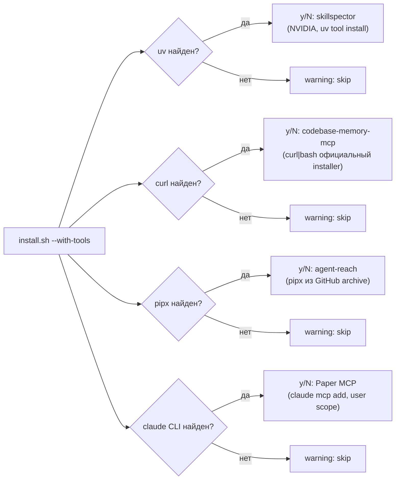

---

## 9. Цепочка поставки скиллов — что проверяет CI

Скилл доезжает до модели как **инструкции, исполняемые с правами пользователя**. Поэтому вендоренный скилл проходит через лок и два независимых гейта.

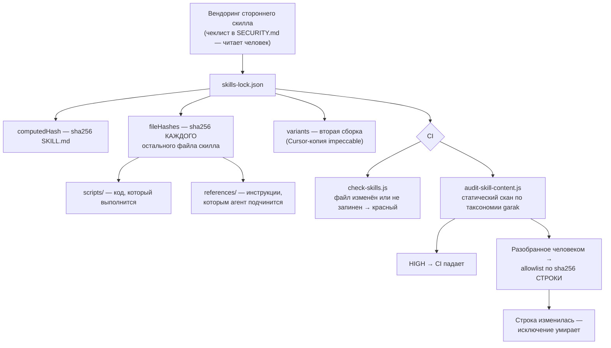

**Чего это НЕ ловит.** Лок ловит *подмену* запиненного скилла и *появление* незапиненного. Он не ловит вредоносный код, запиненный с самого начала. `node --check` и `ruff` проверяют синтаксис, а не намерение. Единственный барьер на входе — человек, прочитавший `SKILL.md` и `scripts/` целиком (чеклист в [`SECURITY.md`](SECURITY.md)).
